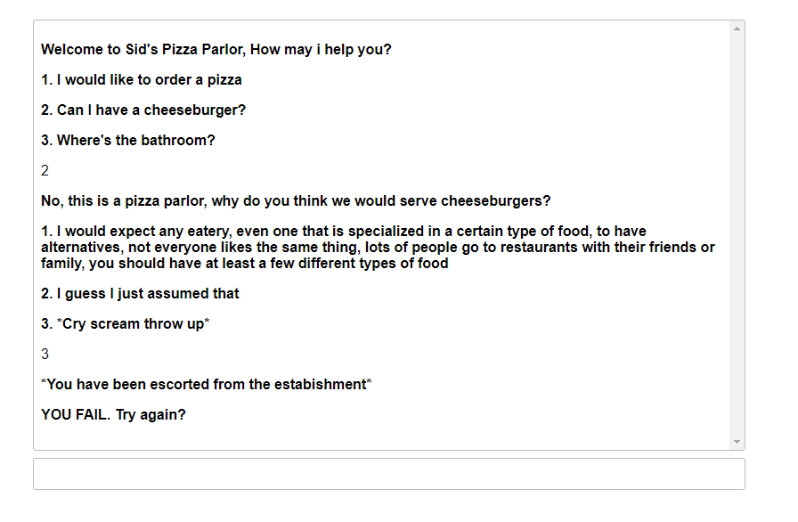

# Prinput

Printput is a Javascript library that lets you use javascript like you would a command line program.

## Why use this library

Here are some reasons you might want to use this
- For prototyping

You can test out programs without having to worry about ui

- For beginners

Beginners can focus on programming fundementals, rather than being bogged down by web apis

- Share command line programs with friends

Do you like making simple command line programs, but it's difficult to share with friends without making them download something?

This library is client side so you can host it for free on somewhere like github pages.

For documentation, see how_to_use.md
